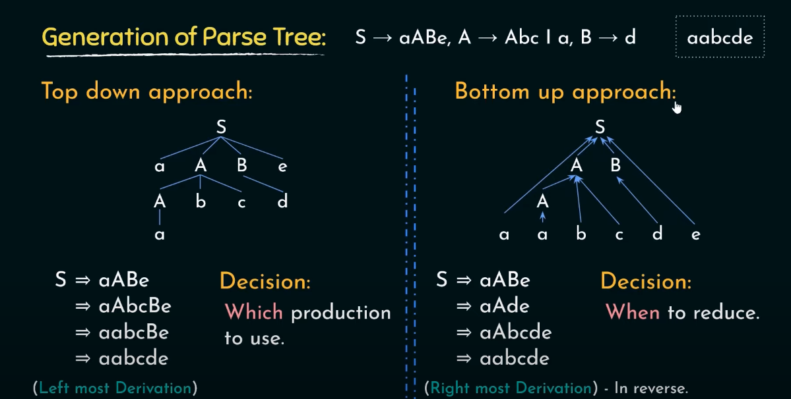

1. COMPILERS - (C) - MACHINE CODE
2. INTERPRETERS - (old PYTHON) - DIRECT RESULT FROM EXECUTION
3. TRANSPILERS - (Javascript transpiler) - convert from one source code to another
4. AOT compiler = Ahead of time compiler - compiled ahead of time (c) - no runtime optimizations. only compile time optimization. static compilation
5. JIT compiler = just in time compilation - runtime optimization

### JIT OPTIMIZATIONS PROCEDUE

1. Counter tracks how often each code block runs
2. When counter exceeds threshold (e.g., 10000 executions), code is considered "hot"
3. Hot code gets compiled to native code
4. Future executions use optimized native code instead of interpretation

- **Lexical Analysis**
  - Regular languages(regular grammar)
  - Finite Automata (state machines)
    - Deterministic Finite Automata - (used in clox ) - DFA - only one path possible - the scxanner of clox
    - Non deterministic Finite Automata - Multiple possible next states for the same input. useful as a step in between regular expressions and finite automata
  - Hand Written Scanner (clox)
  - Table driven scanner
  - advanced scanning techniques 
      - Lookahead buffering (peek() function of clox)
      - lazy lexical analysis
      - error recovery 
        - basic (clox, synchronize())
        - advanced (java)
      - character stream management
        - direct reading (advance() function of clox)
        - buffered reading ( fill up a buffer first, Java)

- **SYNCTACTIC ANALYSIS (syntax)**
Syntactic Analysis is about ensuring the code follows the language's grammar rules - like making sure parentheses match and operators have the correct number of operands. 
  - Recursive Descent Parser - clox -> PRATT PRECEDENCE PARSER -> 
    - Context Free grammars
    - operator precedence and associativity
    - recursion stack - 
  - PREDICTIVE PARSER -LL Parser - Left Derivate Parser, Left Right Parser -> Look Ahead Parser LL(1)->look ahead 1 token
  - LR Parser - Shift Reduce Parser -> (left to right, right most derivation) - bottom up parsers - build parser trees from leaves to root - from the nodes of the tokens.  tries to find the longest path possible.
    - SIMPLE LR (SLR)
    - GENERALIZED LR (GLR)
    - LOOK AHEAD LR (LALR)
    - CANONICAL LR (CLR)
  - PEG - PARSING EXPRESSION GRAMMAR (PYTHON)
  - AST - (USED IN RUST)

- **Semantic Analysis**
  - Parse token sequence
  - Scope Analysis (resolveLocal() in clox)
  - Type Checking 

- **Code Gen**
  - Stack Based VMs

- **Optimization**
  - constant folding
  - loop optimization
  - loop unrolling ( reduce branch overhead)
  - strength reduction ( use cheap instrucitons instead of expensive ones)
  - loop invariant code motion (LICM) (remove unchaing code outside of the loop)
  - dataflow optimization
    - common sub expressoin elimination
    - Strong reduction
      - Byte + overhead
        - LLVM Query

